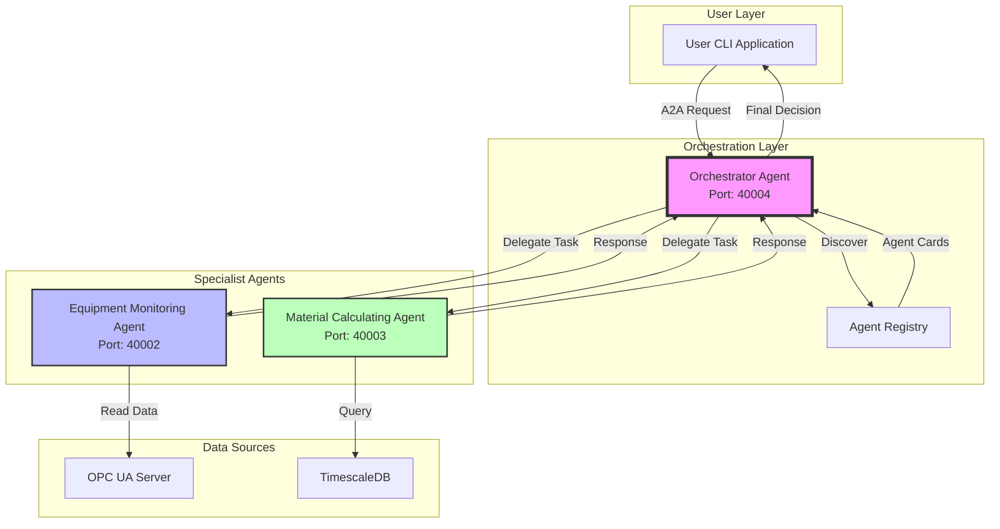

# 🏭 Multi-Agent Industrial AI System with A2A Protocol

Build a distributed multi-agent AI system for industrial automation using Google's Agent-to-Agent (A2A) protocol, enabling seamless communication between specialized AI agents.


## 📺 Video Tutorial Series

This is **Part 5** (Final) of a comprehensive video tutorial series by Kudzai Manditereza on building agentic AI for industrial systems.

🎥 **[Part 5: How to Build Multi-Agent Industrial AI System Using A2A](https://youtu.be/9gmpHMjwbJs)**

### Complete Series:
- Part 1: [Build an Industrial AI Agent From Scratch](https://youtu.be/8CRXdrqPjgU)
- Part 2: [How to build a local industrial AI agent](https://youtu.be/0Xq3RKkPvcY)
- Part 3: [Build Agentic RAG for Industrial Data](https://youtu.be/qGZ_tjXdBgI)
- Part 4: [Build MCP Server for Industrial Data](https://youtu.be/GqdOphladp8)
- **Part 5: Multi-Agent Industrial AI System with A2A** (This Project)

## 🎯 Overview

Transform your monolithic industrial AI agent into a **distributed multi-agent system** where specialized agents collaborate through standardized communication protocols.

### The Evolution

**Previous Approach (Parts 1-4):**
- Single monolithic agent handling everything
- Complex, hard to maintain
- Limited scalability

**New Multi-Agent Approach:**
- **Specialized agents** with focused responsibilities
- **Standardized communication** via A2A protocol
- **Scalable architecture** - add agents as needed
- **Vendor agnostic** - agents can use different frameworks

### The Three Agents

1. **🔧 Equipment Monitoring Agent**
   - Specializes in real-time data
   - Connects to OPC UA server
   - Monitors tank levels and machine states

2. **📊 Material Calculating Agent**
   - Specializes in product knowledge
   - Queries database for recipes
   - Calculates material requirements

3. **🎯 Orchestrator Agent**
   - Coordinates other agents
   - Makes production decisions
   - Provides unified interface

## ✨ Key Features

### A2A Protocol Implementation
- **Standardized messaging** using JSON-RPC 2.0
- **Dynamic agent discovery** through agent cards
- **Task orchestration** with state management
- **Bi-directional communication** - agents can be both clients and servers

### Core Capabilities
- ✅ Agent self-description via agent cards
- ✅ Automatic capability discovery
- ✅ Asynchronous task handling
- ✅ Multi-modal data exchange
- ✅ Built-in error handling
- ✅ Scalable architecture

## 🏗️ System Architecture



### A2A Protocol Components

**1. Agent Cards** - Self-description
```json
{
  "name": "EquipmentMonitoringAgent",
  "description": "Monitors material availability and machine states",
  "url": "http://localhost:40002/",
  "skills": [{
    "id": "material-availability",
    "name": "Get Material Levels",
    "examples": ["What materials are available?"]
  }]
}
```

**2. JSON-RPC Messages** - Standardized communication
```json
{
  "jsonrpc": "2.0",
  "method": "tasks/send",
  "params": {
    "id": "task-123",
    "message": {
      "role": "user",
      "parts": [{"type": "text", "text": "Can I produce 4 batches?"}]
    }
  }
}
```

**3. Task Management** - Orchestrated workflow
- Task submission
- Progress tracking
- Result aggregation

## 📋 Prerequisites

- Python 3.8+
- PostgreSQL/TimescaleDB
- OPC UA Server (real or simulated)
- Anthropic API key (for Claude LLM)

## 🚀 Installation

### 1. Clone Repository
```bash
git clone https://github.com/yourusername/a2a-industrial-multiagent.git
cd a2a-industrial-multiagent
```

### 2. Create Virtual Environment
```bash
python -m venv venv
source venv/bin/activate  # On Windows: venv\Scripts\activate
```

### 3. Install Dependencies
```bash
pip install -r requirements.txt
```

### 4. Configure Environment
Create `.env` file:
```env
# LLM Configuration
ANTHROPIC_API_KEY=your_anthropic_api_key

# Database Configuration
DB_USER=your_db_user
DB_PASSWORD=your_db_password
DB_HOST=localhost
DB_PORT=5432

# OPC UA Configuration
OPC_SERVER_URL=opc.tcp://desktop-fjjsr46:26543/BatchPlantServer
```


## 📖 Usage

### Starting the Multi-Agent System

**1. Start Equipment Monitoring Agent**
```bash
python -m agents.equipment_monitoring_agent --port 40002
```
Output:
```
INFO: EquipmentMonitoringAgent running at http://localhost:40002
INFO: A2A server started - listening for tasks
```

**2. Start Material Calculating Agent**
```bash
python -m agents.material_calculating_agent --port 40003
```
Output:
```
INFO: MaterialCalculatingAgent running at http://localhost:40003
INFO: A2A server started - listening for tasks
```

**3. Start Orchestrator Agent**
```bash
python -m agents.orchestrator_agent --port 40004
```
Output:
```
INFO: Discovering agents from registry...
INFO: ✓ EquipmentMonitoringAgent discovered
INFO: ✓ MaterialCalculatingAgent discovered
INFO: OrchestratorAgent running at http://localhost:40004
```

**4. Start User CLI Application**
```bash
python -m app.cmd --target http://localhost:40004
```

### Example Interactions

**Direct Agent Query:**
```bash
# Connect to Equipment Monitoring Agent
python -m app.cmd --target http://localhost:40002

> What is the material availability and machine states?
Agent says:
{
  "machine_states": {
    "mixer_state": "running",
    "reactor_state": "idle",
    "filler_state": "idle"
  },
  "material_availability": {
    "tank1_material_level": 8543.21,
    "tank2_material_level": 12456.78,
    "tank3_material_level": 9823.45
  }
}
```

**Orchestrated Query:**
```bash
# Connect to Orchestrator
python -m app.cmd --target http://localhost:40004

> Can I produce 4 batches of Product A?
Agent says:
{
  "decision": "Yes",
  "reasoning": "Sufficient materials and operational equipment available",
  "sufficient_materials": true,
  "machine_states": {...},
  "material_availability": {...},
  "tools_used": ["MaterialCalculatingAgent", "EquipmentMonitoringAgent"]
}
```

## 📁 Project Structure

```
a2a-industrial-multiagent/
├── agents/                        # Agent implementations
│   ├── equipment_monitoring_agent/
│   │   ├── __main__.py           # Entry point & A2A server
│   │   ├── agent.py              # LangChain agent logic
│   │   ├── opcua_data_access.py  # OPC UA client
│   │   ├── task_manager.py       # A2A task handler
│   │   └── tools.py              # LangChain tools
│   │
│   ├── material_calculating_agent/
│   │   ├── __main__.py           # Entry point & A2A server
│   │   ├── agent.py              # LangChain agent logic
│   │   ├── database_data_access.py # DB queries
│   │   ├── task_manager.py       # A2A task handler
│   │   └── tools.py              # LangChain tools
│   │
│   └── orchestrator_agent/
│       ├── __main__.py           # Entry point & A2A server
│       ├── agent.py              # Orchestration logic
│       ├── agent_connect.py      # Agent discovery/connection
│       └── task_manager.py       # A2A task handler
│
├── app/                          # User applications
│   ├── __init__.py
│   └── cmd.py                    # CLI interface
│
├── shared/                       # Shared A2A implementation
│   ├── a2a/
│   │   ├── agent_registry.json   # Agent registry
│   │   ├── client.py             # A2A client
│   │   ├── discovery.py          # Agent discovery
│   │   ├── server.py             # A2A server
│   │   └── task_manager.py       # Task management
│   │
│   └── models/                   # A2A data models
│       ├── agent.py              # AgentCard, Skills
│       ├── json_rpc.py           # JSON-RPC models
│       ├── request.py            # Request/Response
│       └── task.py               # Task models
│
├── .env                          # Environment variables
└── requirements.txt              # Dependencies
```

## 🔄 How It Works

### 1. Agent Registration & Discovery

```python
# Agent publishes its card at /.well-known/agent.json
agent_card = AgentCard(
    name="EquipmentMonitoringAgent",
    skills=[AgentSkill(id="monitor", name="Monitor Equipment")]
)

# Orchestrator discovers agents
discovery = DiscoveryClient()
agents = await discovery.list_agent_cards()
```

### 2. Task Delegation

```python
# Orchestrator delegates to specialist
connector = AgentConnector("EquipmentMonitoringAgent", "http://localhost:40002")
result = await connector.send_task("Check material levels", session_id)
```

### 3. Response Aggregation

```python
# Combine results from multiple agents
materials = await material_agent.check_requirements()
equipment = await equipment_agent.check_availability()
decision = analyze(materials, equipment)
```

## 🧪 Testing

### Unit Tests
```bash
pytest tests/
```

### Integration Test
```python
# Test agent communication
async def test_agent_communication():
    # Start agents
    equipment_agent = EquipmentMonitoringAgent()
    orchestrator = OrchestratorAgent()
    
    # Send task
    response = await orchestrator.invoke("Can we produce 5 batches?")
    assert response["decision"] in ["Yes", "No"]
```

### Health Check
```bash
# Check if all agents are running
curl http://localhost:40002/.well-known/agent.json
curl http://localhost:40003/.well-known/agent.json
curl http://localhost:40004/.well-known/agent.json
```

## 🚀 Extending the System

### Adding New Agents

1. **Create Agent Structure**
```python
class NewSpecialistAgent:
    SUPPORTED_CONTENT_TYPES = ["text"]
    
    async def invoke(self, query: str) -> str:
        # Agent logic here
        return result
```

2. **Define Agent Card**
```python
agent_card = AgentCard(
    name="NewSpecialistAgent",
    skills=[AgentSkill(id="new-skill")]
)
```

3. **Register in Registry**
```json
{
  "agents": [
    {"url": "http://localhost:40005"}
  ]
}
```

## 🚧 Troubleshooting

### Common Issues

**1. Agent Discovery Fails**
- Verify all agents are running
- Check agent_registry.json paths
- Ensure network connectivity

**2. Task Timeout**
```python
# Increase timeout in orchestrator
self.child_agent_timeout = 60.0  # seconds
```

**3. JSON-RPC Errors**
- Validate message format
- Check method names match exactly
- Ensure params structure is correct

## 🛣️ Roadmap

- [ ] Add WebSocket support for real-time updates
- [ ] Implement agent health monitoring dashboard
- [ ] Add authentication/authorization
- [ ] Create agent deployment with Docker
- [ ] Build web-based orchestration UI
- [ ] Add more specialized agents (maintenance, quality, etc.)

## 🤝 Contributing

Contributions welcome! Please:
1. Fork the repository
2. Create a feature branch
3. Implement with tests
4. Submit a Pull Request

## 📝 License

MIT License - see [LICENSE](LICENSE) file

## 🙏 Acknowledgments

- **Kudzai Manditereza** - Tutorial creator and Industrial AI Expert
- **Google** - A2A Protocol specification
- **Anthropic** - Claude LLM
- **LangChain** - Agent framework

## 🔗 Resources

- [Video Tutorial](https://youtu.be/9gmpHMjwbJs)
- [A2A Protocol Spec](https://github.com/google/agent-to-agent)
- [LangChain Docs](https://python.langchain.com/)
- [OPC UA Foundation](https://opcfoundation.org/)

## 📧 Contact

- YouTube: [Kudzai Manditereza](https://www.youtube.com/@industry40tvonline)
- LnkedIn: [Kudzai Manditereza](https://www.linkedin.com/in/kudzaimanditereza/)

---

**⭐ Star this repo to support multi-agent industrial AI development!**

