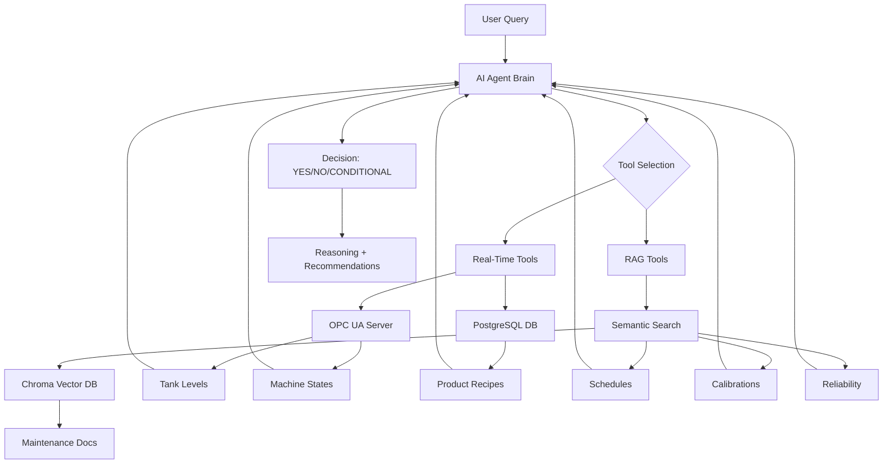

# 🏭 Agentic RAG for Industrial AI Agent

Build an intelligent AI agent with Retrieval-Augmented Generation (RAG) that makes production decisions using real-time data, maintenance documents, and semantic search.


## 📺 Video Tutorial Series

This is **Part 3** of a comprehensive video tutorial series by Kudzai Manditereza on building agentic AI for industrial systems.

🎥 **[Part 3: How to Build Agentic RAG for Industrial Data](https://youtu.be/qGZ_tjXdBgI)**

### Complete Series:
- Part 1: [Build an Industrial AI Agent From Scratch](https://youtu.be/8CRXdrqPjgU)
- Part 2: [Deploy Local LLMs for Industrial Edge Computing](https://youtu.be/0Xq3RKkPvcY)
- **Part 3: Build Agentic RAG for Industrial Data** (This Project)
- Part 4: [How to Build A Model Context Protocol (MCP) Server for Industrial Data](https://youtu.be/GqdOphladp8)
- Part 5: [How to build a Multi-Agent Industrial AI System Using Agent-to-Agent (A2A) protocol](https://youtu.be/9gmpHMjwbJs)

## 🎯 Overview

This enhanced version of the Industrial AI Agent adds **Agentic RAG** capabilities, allowing the system to reason over both structured data (OPC UA, databases) and unstructured documents (maintenance schedules, calibration certificates, equipment reports).

### What's New in This Version

The agent now considers:
- 📅 **Maintenance Schedules**: Checks for upcoming preventive maintenance that could conflict with production
- 🔬 **Calibration Status**: Verifies critical instruments are within calibration dates
- ⚡ **Equipment Reliability**: Assesses MTBF, vibration levels, and spare parts availability
- 📄 **Document Context**: Semantic search through maintenance documentation for relevant constraints

### Naive RAG vs Agentic RAG

This project implements **Agentic RAG**, where:
- The AI agent **decides** when to search documents (not forced on every query)
- RAG is provided as a **tool** the agent can choose to use
- More efficient and intelligent than naive RAG approaches
- Reduces unnecessary context and improves response quality

## ✨ Key Features

### Core Capabilities
- ✅ Natural language production queries
- ✅ Real-time OPC UA data integration
- ✅ Database recipe management
- ✅ Semantic search through maintenance documents
- ✅ Local embedding models (no cloud dependency)
- ✅ Persistent vector database with Chroma
- ✅ Intelligent tool selection by the agent
- ✅ Comprehensive GO/NO-GO decisions with reasoning

### Decision Factors
The agent analyzes:
1. **Material Availability** - Tank levels vs. recipe requirements
2. **Equipment Status** - Machine operational states
3. **Maintenance Windows** - Scheduled PM conflicts
4. **Calibration Compliance** - Instrument validity
5. **Reliability Metrics** - MTBF, vibration, spare parts
6. **Product-Specific Rules** - Special constraints per product type

## 🏗️ Architecture



### Components

1. **Data Sources**
   - OPC UA Server: Real-time equipment data
   - PostgreSQL: Product recipes and materials
   - Maintenance Documents: Schedules, reports, calibrations

2. **RAG Pipeline**
   - Embedding Model: Ollama (local) or OpenAI (cloud)
   - Vector Database: ChromaDB for persistent storage
   - Document Splitter: Chunks documents for precise search
   - Semantic Search: Finds relevant context based on meaning

3. **AI Agent**
   - LLM: Claude 3.5 Sonnet / GPT-4 / Local models
   - Tool Orchestration: LangChain agent executor
   - Decision Engine: GO/NO-GO with detailed reasoning

## 📋 Prerequisites

- Python 3.8+
- PostgreSQL/TimescaleDB
- OPC UA server (real or simulated)
- Ollama (for local embeddings) or OpenAI API key
- Anthropic/OpenAI API key for LLM

## 🚀 Installation

### 1. Clone the Repository
```bash
git clone https://github.com/yourusername/agentic-rag-industrial-ai.git
cd agentic-rag-industrial-ai
```

### 2. Create Virtual Environment
```bash
python -m venv venv
source venv/bin/activate  # On Windows: venv\Scripts\activate
```

### 3. Install Dependencies
```bash
pip install -r requirements.txt
```

### 4. Install Ollama (for Local Embeddings)
Download from [ollama.com](https://ollama.com) and install for your OS.

Then pull the embedding model:
```bash
ollama pull mxbai-embed-large
```

Verify installation:
```bash
ollama list
```

### 5. Configure Environment Variables
Create `.env` file:
```env
# LLM API Keys
ANTHROPIC_API_KEY=your_anthropic_key
OPENAI_API_KEY=your_openai_key  # Optional

# Database
DB_USER=your_db_user
DB_PASSWORD=your_db_password
DB_HOST=localhost
DB_PORT=5432
```


### 7. Add Maintenance Documents
Create `maintenance_docs/` folder with markdown files:
```
maintenance_docs/
├── maintenance_schedule_doc.md
└── maintenance_report_doc.md
```

See the provided examples for document structure.

## ⚙️ Configuration

### RAG Configuration
In `maintenance_rag.py`:
```python
# Choose embedding model
embedding_model = "local"  # or "openai"

# Configure Chroma persistence
persist_directory = "./chroma_db"

# Document chunking
chunk_size = 1000
chunk_overlap = 200
```

### LLM Selection
In `main.py`:
```python
# Option 1: Claude (Recommended)
llm = ChatAnthropic(model="claude-3-5-sonnet-20241022")

# Option 2: GPT-4
llm = ChatOpenAI(model="gpt-4o")

# Option 3: Local with Ollama
llm = ChatOllama(model="mistral", temperature=0)
```

## 📖 Usage

### Basic Usage

```bash
python main.py
```

Example queries:
```
✅ Can we produce 50 batches of Product A starting tomorrow?
✅ Is it safe to start Product A production on January 23?
✅ Check if we can run 30 batches of Product A today
```

### Expected Output

```
==================================================
🏭 PRODUCTION FEASIBILITY ASSESSMENT
==================================================

✅ DECISION: YES

📋 REASONING:
All checks pass for producing 50 batches of Product A tomorrow.
Material requirements: 5000L Material A (Available: 8000L ✓)
No maintenance conflicts found for the production window.
All equipment health scores above minimum thresholds.

📦 MATERIAL ASSESSMENT:
   Sufficient Materials: ✅ Yes
   • tank1_material_level: 8,000.00 units
   • tank2_material_level: 13,032.00 units
   • tank3_material_level: 18,947.00 units

🔧 MACHINE STATES:
   🟢 mixer_state: idle
   🟢 reactor_state: running
   🟢 filler_state: idle

🔧 MAINTENANCE CONFLICTS:
   None detected

💡 RECOMMENDATIONS:
   → Proceed with production as planned
   → Monitor reactor vibration levels (currently 4.2 mm/s)
   → Schedule tank refill after production run

🛠️ ANALYSIS TOOLS USED:
   • get_product_details
   • get_material_availability
   • get_machine_states
   • check_maintenance_schedule
   • check_calibration_status
==================================================
```

### Testing Individual Components

**Test RAG System:**
```bash
python maintenance_rag.py
```

**Test All Tools:**
```bash
python tools.py
```

**Run Test Scenarios:**
```python
# In main.py, uncomment:
run_test_scenarios()
```

## 📁 Project Structure

```
agentic-rag-industrial-ai/
├── batch_plant_functions.py    # OPC UA client
├── batch_plant_storage.py      # Database interface
├── maintenance_rag.py          # RAG implementation with Chroma
├── tools.py                    # Enhanced tools with RAG
├── main.py                     # Agent with RAG integration
├── requirements.txt            # Dependencies
├── .env                       # Environment variables
├── maintenance_docs/          # Maintenance documents
│   ├── maintenance_schedule_doc.md
│   └── maintenance_report_doc.md
└── chroma_db/                 # Vector database (auto-created)
```

## 🔄 How Agentic RAG Works

1. **Document Indexing**
   - Load markdown documents
   - Split into chunks (1000 chars with overlap)
   - Generate embeddings using Ollama/OpenAI
   - Store in Chroma vector database

2. **Query Processing**
   - User asks production question
   - Agent analyzes query and available tools
   - Decides if document search is needed
   - Performs semantic search if required

3. **Context Integration**
   - Retrieves relevant document chunks
   - Extracts specific information (dates, conflicts)
   - Combines with real-time data
   - Makes informed decision

4. **Decision Output**
   - YES/NO/CONDITIONAL verdict
   - Detailed reasoning with evidence
   - Specific recommendations
   - Risk assessment

## 🧪 Maintenance Document Examples

### Schedule Document Format
```markdown
### REACTOR-01 (Batch Reactor)
- **Next Scheduled PM:** January 25, 2025, 06:00-18:00
- **Duration:** 12 hours
- **Production Impact:** FULL SHUTDOWN REQUIRED

### Product A
- Cannot be produced within 24 hours after reactor maintenance
```

### Report Document Format
```markdown
### Equipment Reliability Metrics
- **MIXER-01:** 
  - MTBF: 720 hours
  - Vibration: 3.8 mm/s (Alert: >7.5)
```

## 🚧 Troubleshooting

### Common Issues

**1. Ollama Connection Error**
```bash
# Ensure Ollama is running
ollama serve
```

**2. Chroma Database Issues**
```python
# Clear and rebuild index
from maintenance_rag import MaintenanceRAG
rag = MaintenanceRAG()
rag.clear_database()
```

**3. OPC UA Connection Failed**
- Verify server URL and port
- Check network connectivity
- Ensure node IDs are correct

## 🤝 Contributing

Contributions welcome! Please:
1. Fork the repository
2. Create a feature branch
3. Commit changes
4. Push to branch
5. Open a Pull Request

## 📝 License

MIT License - see [LICENSE](LICENSE) file for details.

## 🙏 Acknowledgments

- **Kudzai Manditereza** - Tutorial creator and industrial AI expert
- **LangChain** - Agent framework
- **Chroma** - Vector database
- **Ollama** - Local model deployment
- **Anthropic/OpenAI** - LLM providers

## 🔗 Resources

- [Video Tutorial](https://youtu.be/qGZ_tjXdBgI)
- [LangChain Docs](https://python.langchain.com/)
- [ChromaDB Docs](https://docs.trychroma.com/)
- [Ollama](https://ollama.com/)
- [OPC UA Foundation](https://opcfoundation.org/)

## 📧 Contact

- YouTube: [Kudzai Manditereza](https://www.youtube.com/@industry40tvonline)
- LinkedIn: [Your Profile](https://www.linkedin.com/in/kudzaimanditereza/)

---

**⭐ If this project helps you build smarter industrial AI systems, please star it!**

**🔔 Subscribe to the YouTube channel for Parts 4 & 5 of this series!**