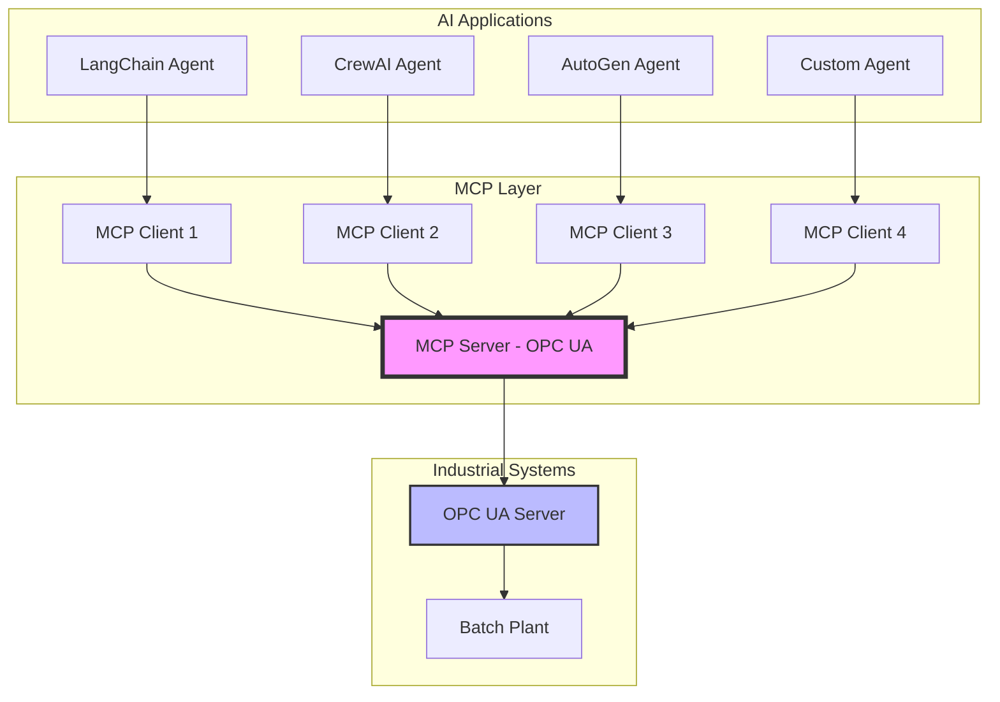

# 🏭 MCP Server for Industrial OPC UA Data

Build a Model Context Protocol (MCP) server that standardizes AI agent access to industrial data sources, enabling any LLM-powered application to connect without custom integrations.

## 📺 Video Tutorial Series

This is **Part 4** of a comprehensive video tutorial series by Kudzai Manditereza on building agentic AI for industrial systems.

🎥 **[Part 4: How to Build an MCP Server for Industrial Data](https://youtu.be/GqdOphladp8)**

### Complete Series:
- Part 1: [Build an Industrial AI Agent From Scratch](https://youtu.be/8CRXdrqPjgU)
- Part 2: [How to build a local industrial AI agent](https://youtu.be/0Xq3RKkPvcY)
- Part 3: [Build Agentic RAG for Industrial Data](https://youtu.be/qGZ_tjXdBgI)
- **Part 4: Build MCP Server for Industrial Data** (This Project)
- Part 5: [How to build a Multi-Agent Industrial AI System Using Agent-to-Agent (A2A) protocol](https://youtu.be/qGZ_tjXdBgI)

## 🎯 Overview

The Model Context Protocol (MCP) solves a critical problem in industrial AI: **the constant reinvention of custom integrations**. Instead of building custom connections for each AI agent framework, MCP provides a standardized server that exposes tools and data consistently.

### The Problem

In previous parts, we built AI agents using LangChain that connected to:
- OPC UA servers for real-time data
- TimescaleDB for recipes
- Maintenance documents via RAG

But what happens when you need to:
- Add a CrewAI agent?
- Integrate with Google's Agent Development Kit?
- Connect Microsoft's AutoGen agents?

**You'd have to rebuild all integrations for each framework!** 🔄

### The Solution: MCP

MCP standardizes how LLM applications connect to tools and data:
- **Build once, use everywhere** 🚀
- **Framework agnostic** - works with any AI agent
- **Standardized communication** protocol
- **No more custom integrations** for each agent type

## ✨ Key Features

### MCP Architecture
- **Client-Server Model**: Standardized communication protocol
- **Tool Exposure**: Functions become universally accessible tools
- **Transport Options**: STDIO for local, HTTP for remote
- **Framework Agnostic**: Works with any LLM application

### Industrial Data Access
- ✅ Real-time OPC UA server connection
- ✅ Tank level monitoring
- ✅ Equipment state tracking
- ✅ Automatic machine state interpretation
- ✅ JSON-formatted responses
- ✅ Error handling and connection management

## 🏗️ MCP Architecture



### MCP Components

1. **MCP Host**: AI application managing clients
2. **MCP Client**: Maintains connection to server
3. **MCP Server**: Provides tools and resources

### MCP Primitives

**Server-Side (What we're building):**
- 🔧 **Tools**: Executable functions (get_material_availability, get_machine_states)
- 📊 **Resources**: Data sources (OPC UA tags, sensor values)
- 📝 **Prompts**: Reusable templates for optimal results

**Client-Side:**
- 🤖 **Sampling**: Request LLM completions
- 💬 **Elicitation**: Request user input
- 📝 **Logging**: Debug and monitoring

## 📋 Prerequisites

- Python 3.13+ (required for FastMCP)
- OPC UA Server (real or simulated)
- UV package manager (recommended) or pip

## 🚀 Installation

### 1. Install UV Package Manager (Recommended)

```bash
# On macOS/Linux
curl -LsSf https://astral.sh/uv/install.sh | sh

# On Windows
powershell -c "irm https://astral.sh/uv/install.ps1 | iex"
```

### 2. Clone the Repository

```bash
git clone https://github.com/yourusername/mcp-industrial-opcua.git
cd mcp-industrial-opcua
```

### 3. Initialize Project with UV

```bash
# Initialize the project
uv init

# Create virtual environment
uv venv

# Activate virtual environment
# On macOS/Linux:
source .venv/bin/activate
# On Windows:
.venv\Scripts\activate
```

### 4. Install Dependencies

```bash
uv pip install -r requirements.txt
```

Or if using standard pip:
```bash
pip install asyncua>=1.0.0 mcp
```


## 📖 Usage

### Running the MCP Server

```bash
# Start the server
uv run batch_plant_functions.py
```

The server will run with STDIO transport by default.

### Testing with MCP Inspector

MCP Inspector is a browser-based tool for exploring your MCP server:

```bash
# Install MCP Inspector globally
npm install -g @modelcontextprotocol/inspector

# Run inspector with your server
mcp-inspector uv run batch_plant_functions.py
```

This will:
1. Start your MCP server
2. Open a browser with the inspector
3. Allow you to explore and test your tools

### Available Tools

#### 1. `get_material_availability`
Returns current tank levels in JSON format:
```json
{
  "tank1_material_level": 8543.21,
  "tank2_material_level": 12456.78,
  "tank3_material_level": 9823.45
}
```

#### 2. `get_machine_states`
Returns current equipment states:
```json
{
  "mixer_state": "idle",
  "reactor_state": "running",
  "filler_state": "idle"
}
```

## 🧪 Testing

### Manual Testing
```python
# Test script
import asyncio
from batch_plant_functions import get_material_availability, get_machine_states

async def test():
    print("Material Levels:", await get_material_availability())
    print("Machine States:", await get_machine_states())

asyncio.run(test())
```

### Using MCP Inspector

1. Connect to server
2. Navigate to "Tools" tab
3. Click "List Tools" to see available functions
4. Select a tool and click "Run" to execute
5. View real-time results in JSON format

## 📁 Project Structure

```
mcp-industrial-opcua/
├── batch_plant_functions.py  # MCP server with OPC UA tools
├── main.py                   # Entry point
├── pyproject.toml           # Project configuration
├── requirements.txt         # Dependencies
├── README.md               # This file
├── .env                    # Environment variables (create this)
└── .venv/                  # Virtual environment (auto-created)
```

## 🔄 How It Works

1. **OPC UA Connection**
   - Client connects to industrial OPC UA server
   - Reads real-time sensor and equipment data

2. **MCP Tool Definition**
   - Python functions decorated with `@mcp_server.tool()`
   - Automatically exposed as MCP tools

3. **Standardized Access**
   - Any MCP client can discover and use tools
   - No framework-specific code needed

4. **Transport Layer**
   - STDIO for local process communication
   - HTTP for remote access (optional)

## 🚀 Integration Examples

### With Claude Desktop

Add to Claude's configuration:
```json
{
  "mcpServers": {
    "opcua-server": {
      "command": "uv",
      "args": ["run", "path/to/batch_plant_functions.py"],
      "transport": "stdio"
    }
  }
}
```

### With LangChain

```python
from langchain_mcp import MCPToolkit

toolkit = MCPToolkit(
    server_command=["uv", "run", "batch_plant_functions.py"]
)
tools = toolkit.get_tools()
```

### With Custom Applications

```python
import subprocess
import json

# Start MCP server
process = subprocess.Popen(
    ["uv", "run", "batch_plant_functions.py"],
    stdin=subprocess.PIPE,
    stdout=subprocess.PIPE
)

# Send requests using MCP protocol
# ... implementation details
```

## 🔧 Extending the Server

### Adding New Tools

```python
@mcp_server.tool()
async def get_production_metrics() -> str:
    """Get production KPIs and metrics"""
    # Implementation here
    return json.dumps(metrics)
```

### Adding Resources

```python
@mcp_server.resource("opcua://tank1/level")
async def tank1_level_resource():
    """Expose tank 1 level as a resource"""
    # Implementation
```

### Adding Prompts

```python
@mcp_server.prompt()
def production_analysis_prompt():
    """Template for production analysis"""
    return """Analyze production feasibility based on:
    - Material levels: {materials}
    - Machine states: {states}
    """
```

## 🚧 Troubleshooting

### Common Issues

**1. Connection to OPC UA Failed**
```bash
# Verify server is running
# Check SERVER_URL is correct
# Ensure network connectivity
```

**2. MCP Inspector Not Opening**
```bash
# Ensure npm is installed
npm install -g @modelcontextprotocol/inspector
```

**3. Python Version Error**
```bash
# MCP requires Python 3.13+
python --version
# Upgrade if needed
```


## 📝 License

MIT License - see [LICENSE](LICENSE) file for details.

## 🙏 Acknowledgments

- **Kudzai Manditereza** - Tutorial creator and industrial AI expert
- **Anthropic** - Model Context Protocol specification
- **FastMCP** - High-level Python MCP framework
- **AsyncUA** - Async OPC UA implementation

## 🔗 Resources

- [Video Tutorial](https://youtu.be/GqdOphladp8)
- [MCP Specification](https://modelcontextprotocol.io/)
- [FastMCP Documentation](https://github.com/jlowin/fastmcp)
- [OPC UA Foundation](https://opcfoundation.org/)
- [MCP Inspector](https://github.com/modelcontextprotocol/inspector)

## 📧 Contact

- YouTube: [Kudzai Manditereza](https://www.youtube.com/@industry40tvonline)
- LinkedIn: [Your Profile](https://www.linkedin.com/in/kudzaimanditereza/)

---

**⭐ Star this repo if you find MCP useful for industrial AI!**

**🔔 Watch Part 5 for Multi-Agent Systems with A2A Protocol!**